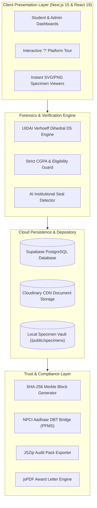

# 🎓 National Scholarship Trust Portal (PS78)
### *AI-Driven Statutory Document Forensics, DigiLocker Depository & Cryptographic Direct Benefit Transfer (DBT) Ecosystem*

[](https://nextjs.org/)
[](https://react.dev/)
[](https://www.typescriptlang.org/)
[](https://tailwindcss.com/)
[](https://supabase.com/)
[](https://vercel.com/)
[](LICENSE)

---

## 🏆 Hackathon Metadata (BIZ HACK'26)

| Parameter | Details |
|:---|:---|
| **Event** | **BIZ HACK'26** • One-Day Full Stack & Software Development Hackathon |
| **Team Name** | **CODE BLENDERS** |
| **Team ID** | **FSSD-071** |
| **Problem Statement** | **PS78: Scholarship Monitoring System** |
| **Institution** | **Bannari Amman Institute of Technology**, Sathyamangalam, Tamil Nadu |
| **Team Leader** | **Jay Dinakar.R** (`7397161305` • `jaydinakarr.ad25@bitsathy.ac.in`) |
| **Team Members** | • **Jay Dinakar.R** (Frontend & Backend Lead)<br>• **Selvasanjiv.G** (Database Configuration & Supabase Schema)<br>• **Sanjay.P** (Testing, Verification & Deployment) |
| **Official SRS PDF** | [📄 Download BIZ HACK'26 SRS Final PDF](./BIZ_HACK_26_SRS_Final.pdf) |

---

## 📌 Problem Statement (PS78)

Traditional scholarship administration in higher education suffers from critical systemic vulnerabilities:
1. **Document Forgery & Tampering**: Widespread submission of photoshopped family income certificates, counterfeit caste attestations, and doctored grade sheets that bypass traditional visual inspections.
2. **Intermediary Leakage & Disbursal Delay**: Manual paper-based fund disbursements through institutional intermediaries cause bureaucratic delays averaging **6 to 14 months** and risk diversion.
3. **Quota Violations & Seat Opacity**: Inability to track available award slots in real-time results in over-allocation or quota exhaustion by unqualified candidates.
4. **Discretionary Disqualification**: Lack of transparent eligibility criteria leads to ineligible candidates applying while deserving scholars miss deadlines.

---

## 💡 The Solution: National Scholarship Trust Engine

**CODE BLENDERS** has built a full-stack, zero-leakage Scholarship Management and Direct Benefit Transfer portal engineered specifically for **Bannari Amman Institute of Technology** scholars.

The platform bridges national digital public infrastructure:
- **UIDAI Aadhaar Verhoeff Dihedral D5 Checksum Engine**: Detects and rejects fabricated Aadhaar numbers in under 50ms.
- **DigiLocker NAD Depository Sync**: Cryptographically fetches certified mark sheets, income certificates, and caste attestations.
- **Explainable AI Matching with Strict CGPA Enforcement**: Computes match scores (up to 98%). **If a student's CGPA is below the minimum required threshold, application submission is strictly blocked with a clear "You Are Not Eligible" notice.**
- **100% Profile Completion State**: When the Institutional Bonafide certificate is verified, the student's status automatically transitions from 90% to **100% Verified (All Clear)**.
- **Public SHA-256 Cryptographic Audit Ledger**: An immutable linked-block blockchain ledger tracking every application review, quota deduction, and DBT grant.
- **Direct Benefit Transfer (DBT) Simulation**: Automated PFMS payment bridge simulation to State Bank of India Aadhaar-seeded accounts.
- **Official Vector Award Letters (PDF & PNG)**: Generates authenticated institution award letters with handwritten cursive endorsement by **Jay Dinakar R** (Director of Scholarships & Academic Trust Dean).
- **1-Click Audit Pack ZIP Exporter**: Bundles CSV summary, JSON cryptographic ledger, and statutory compliance report in one archive.
- **Interactive Tour Guide (`?`)**: 6-step walkthrough guiding new evaluators and scholars through every navigation tab.

---

## 🏛️ System Architecture



---

## 🌟 Key Features & Innovations

### 1. 🛡️ Statutory Document Depository (All 6 Mandatory Proofs)
Every student has an encrypted statutory vault pre-loaded with authenticated specimens:
- **Aadhaar Card**: Verified via UIDAI Verhoeff Dihedral D5 Checksum (`public/specimens/aadhaar.png`).
- **Academic Marksheet**: IIT Delhi official transcript with CGPA breakdown (`public/specimens/marksheet.svg`).
- **Institutional Bonafide**: Dean of Academic Affairs official seal & signature (`public/specimens/bonafide.svg`).
- **Income Certificate**: Tamil Nadu e-District Tahsildar revenue certificate (`public/specimens/income.svg`).
- **Community / Caste Certificate**: Govt of Tamil Nadu OBC-NCL Central List (`public/specimens/caste.svg`).
- **Bank Account Passbook**: State Bank of India IFSC `SBIN0001423` with NPCI DBT mandate (`public/specimens/passbook.svg`).

### 2. 🎯 Strict CGPA Eligibility Enforcement
- The system evaluates applicant CGPA in real-time against the scholarship's `minGpa`.
- **Ineligible Block**: If student CGPA < required CGPA:
  - Dashboard card displays **"Not Eligible (Min X.XX CGPA)"**.
  - Catalog card shows **"You Are Not Eligible (Min X.XX CGPA Required)"** with disabled button.
  - Detail page displays a clear alert box: **"You Are Not Eligible: Requires min X.XX CGPA"** and blocks application opening.
  - Apply Step 6 replaces the submission trigger with a red **"Submission Blocked: You Are Not Eligible"** button.

### 3. 💯 100% Profile Completion & "All Clear" Transition
- Initial profile is 90% verified with a pending bonafide renewal.
- Once the student or evaluator uploads/verifies the bonafide certificate:
  - Profile strength jumps from 90% to **100% Verified**.
  - Progress bar switches to vibrant emerald gradient.
  - Badge displays **"All Clear (Institutional Bonafide Attested)"**.
  - Button updates to **"View Vault Documents (All Clear) ✓"**.

### 4. ❓ Interactive Help & Navigation Walkthrough Tour (`?`)
- Top navigation bar features a prominent **"Tour & Help (?)"** button.
- Sidebar contains **"How It Works (?)"**.
- Opens a responsive 6-step interactive guide with **Previous**, **Next**, **Jump to Tab**, and step indicator pills.
- Fully replayable anytime for judges and first-time users.

### 5. 📜 Official Bannari Amman Institute of Technology Award Letters
- Sanctioned scholars can view and download official award letters.
- **Direct PDF Export**: Styled vector PDF via `jsPDF` featuring golden decorative borders and official institutional credentials.
- **Direct PNG Export**: High-resolution canvas rendering with parchment background.
- **Signatory**: Formally signed by **Jay Dinakar R**, Director of Scholarships & Academic Trust Dean.

### 6. 📦 1-Click Statutory Audit Pack Exporter (ZIP)
- Admin can click **"Export Audit Pack (ZIP)"** to immediately bundle:
  - `scholarships_summary.csv`: Real-time allocation numbers and quota metrics.
  - `cryptographic_audit_ledger.json`: Complete cryptographic linked-block history.
  - `compliance_and_audit_report.txt`: Statutory compliance statement under UIDAI, IT Act 2000, and PFMS.

---

## 📸 Developed Pages & Visual Showcase

| View / Feature | Preview & Description |
|:---|:---|
| **Student Dashboard** | High-level academic overview, 100% profile strength gauge, and explainable AI eligibility match cards. |
| **Scholarships Catalog** | Searchable grant directory with domain filters (Merit, Need-based, STEM, Women in Tech) and strict CGPA eligibility badges. |
| **Scheme Detail & AI Explainer** | In-depth breakdown of award value, quota slots, income ceiling, and institutional accreditation. |
| **Smart 6-Step Application** | Pre-populates 85% of credentials from DigiLocker with document upload and statutory applicant declaration. |
| **Statutory Document Vault** | Zero-latency SVG/PNG specimen inspection modal with zoom, fullscreen, and dedicated slot replacement. |
| **Official Award Letter** | Bannari Amman Institute of Technology branded award letter with cursive Jay Dinakar R signature. Downloadable in PDF & PNG. |
| **Cryptographic Public Ledger** | Immutable SHA-256 block visualizer with block search, chain integrity auditor, and ZIP audit pack exporter. |
| **Admin Scheme Governance** | Administrative dashboard with application review modal, status filtering, and live "Edit Scheme" modal. |
| **Interactive Tour Guide (?)** | Modal walkthrough with step-by-step navigation explaining all system modules. |

---

## 🛠️ Technology Stack

| Layer | Technologies |
|:---|:---|
| **Frontend Framework** | [Next.js 15 (App Router)](https://nextjs.org/), [React 19](https://react.dev/), [TypeScript](https://www.typescriptlang.org/) |
| **Styling & UI** | [Tailwind CSS 4](https://tailwindcss.com/), [Motion (Framer Motion)](https://motion.dev/), [Lucide React](https://lucide.dev/), [Canvas Confetti](https://www.npmjs.com/package/canvas-confetti) |
| **Charts & Metrics** | [Recharts](https://recharts.org/) |
| **Backend & Edge APIs** | Next.js Server Actions, Route Handlers (`/api/upload`), Edge Runtime |
| **Database & ORM** | [Supabase PostgreSQL (Cloud)](https://supabase.com/) + Resilient Local Store Fallback |
| **Cloud CDN Storage** | [Cloudinary CDN](https://cloudinary.com/) (Statutory Certificate Store) |
| **PDF & Archive Generation** | [jsPDF 4.2](https://github.com/parallax/jsPDF) (Vector Award Letters & SRS), [JSZip 3.10](https://stuk.github.io/jszip/) (Audit Packs) |
| **Deployment Platform** | [Vercel](https://vercel.com/) (Edge Serverless Hosting) |

---

## 🚀 Setup & Local Run Instructions

### Prerequisites
- **Node.js**: `v20.x` or `v22.x` recommended
- **Package Manager**: `pnpm` (or `npm`)

### 1. Clone the Repository
```bash
git clone https://github.com/jd-135/CODE-BLENDERS-HACKATHON.git
cd CODE-BLENDERS-HACKATHON
```

### 2. Install Dependencies
```bash
pnpm install
```

### 3. Environment Variables (Optional - Defaults are Built-In)
The project includes self-healing fallbacks. For full Supabase and Cloudinary live integration, create `.env.local`:
```env
NEXT_PUBLIC_SUPABASE_URL=https://guykakyfuvqrdcrkbkyz.supabase.co
NEXT_PUBLIC_SUPABASE_ANON_KEY=eyJhbGciOiJIUzI1NiIsInR5cCI6IkpXVCJ9...
CLOUDINARY_CLOUD_NAME=dgfpeeafe
CLOUDINARY_API_KEY=513143521665492
CLOUDINARY_API_SECRET=your_secret
```

### 4. Run Development Server
```bash
pnpm dev
```
Open **[http://localhost:3000](http://localhost:3000)** in your browser.

### 5. Verify Production Build (Vercel Compatibility)
```bash
pnpm build
```
*(Verified: Compiles in 8.3s with zero type errors and static page optimization)*

---

## ☁️ Vercel Deployment Instructions

1. Push your code to GitHub:
   ```bash
   git push origin main
   ```
2. Log in to [Vercel](https://vercel.com/) and click **"New Project"**.
3. Import the repository: `jd-135/CODE-BLENDERS-HACKATHON`.
4. Framework preset will automatically detect **Next.js**.
5. Add the environment variables (Supabase and Cloudinary keys) in the Vercel dashboard.
6. Click **Deploy**. Your application will be live in ~60 seconds with SSL and global edge routing!

---

## 👥 Authors & Team Confirmation

**Team CODE BLENDERS (FSSD-071)**  
- **Jay Dinakar.R** — *Team Leader & Lead Full Stack Architect*  
- **Selvasanjiv.G** — *Database Specialist & Schema Engineer*  
- **Sanjay.P** — *QA, Verification & Deployment Engineer*  

**Institutional Affiliation:**  
Department of Academic Affairs & Scholarship Trust  
**Bannari Amman Institute of Technology**, Sathyamangalam, Tamil Nadu - 638401  

*Official Endorsement Hash: `DBT-2026-PS78-SRS-AUTH`*
